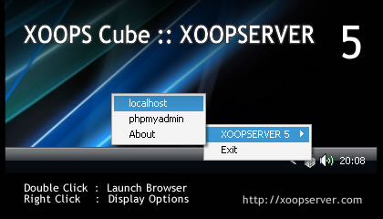
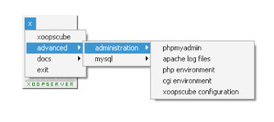

# XOOPServer

**Branchs**

- XOOPServer5
- XOOPServer5-source
- XOOPServer7

## Introduction

Design a web application, and a web site, requires you to take the jump from client-side technologies like HTML/CSS/Javascript, to server-side technologies like PHP. In order to successfully develop in this language, you need the ability to test your work before you launch it into the public domain of the Internet. You have to set up your own web server on your local PC, using freely downloadable software. The combination to work with Apache, MySQL and PHP allows development and testing on a local machine without the concerns of a consistent Internet connection.

## About XOOPServer

:computer: XOOPServer is a portable Windows Apache, MySQL, PHP and phpMyAdmin with required extensions to run and test locally XOOPS Cube Legacy Distributions (Web Application Platform and Modular Architecture Content Management System).

- Apache/2.0.59 (Win32)
- MySQL 5.0.45
- phpMyAdmin - 2.11.0
- PHP/5.2.5

## Environment and PHP Variables

- Server Name : localhost
- Server Adrr : 127.0.0.1
- Server Port : 80
- Document Root : W:/www
- Database User : root
- Database Pass :
- Gateway Interface : CGI/1.1
- Server Protocol: HTTP/1.1

## Installation

- Download XOOPServer archive 
- Unzip to your drive 
- Launch xoopserver.exe 

:warning: **On Windows request: Allow Apache and MySQL**

## Note

:memo: A portable application does not leave its files or settings on the host computer or modify the existing system and its configuration.  
:information_source: The server requires port 80.  
:warning: If you have troubles, check if Skype, Firewall or an antivirus is not prevent server execution.

## Credits

:bust_in_silhouette: Mikhail Miguel

### Backup Google Code Archive SVN

https://code.google.com/archive/p/xoopserver/
